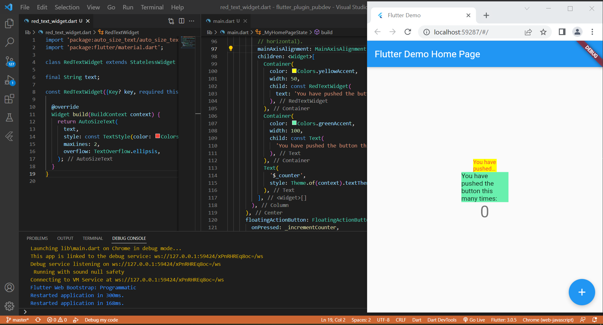

# flutter_plugin_pubdev

Hasil output praktikum flutter plugin pubdev

Pada langkah keempat terdapat error karena belum mendefinisikan variabel text sehingga muncul error undifined. Oleh karena itu pada langkah kelimat didefinisikan dan dibuatkan constructor.

## Tugas Praktikum

### 1. Selesaikan Praktikum tersebut, lalu dokumentasikan dan push ke repository Anda berupa screenshot hasil pekerjaan beserta penjelasannya di file README.md!

Jawab: Hasil dapat dilihat pada gambar di atas

### 2. Jelaskan maksud dari langkah 2 pada praktikum tersebut!

Jawab: Pada langkah kedua kita melakukan penambahan plugin auto_size_text yang berfungsi untuk mengatur teks yang secara otomatis mengubah ukuran teks agar pas dengan sempurna di dalam batasnya.

### 3. Jelaskan maksud dari langkah 5 pada praktikum tersebut!

Jawab: Pada langkah kelima kita membuat atau mendefinisikan variabel text agar dapat digunakan pada class RedTextWidget dan membuat sebuah constructor untuk menginisialisasi atau mempersiapkan data yakni variabel text untuk objek. 

### 4. Pada langkah 6 terdapat dua widget yang ditambahkan, jelaskan fungsi dan perbedaannya!

Jawab: Pada langkah keenam kita membuat 2 widget yakni widget yang pertama memiliki style warna yellowAccent width 50 serta sebuah text yang menerapkan class RedTextWidget dan artinya secara otomatis widget tersebut akan mengikuti aturan dari class tersebut yang berisi AutoSizeText, Sedangkan pada widget kedua hanya berupa text biasa yang diberi style warna greenAccent dan width 100 serta berisi text tanpa menerapkan class RedTextWidget sehingga tidak berpacu pada aturan tersebut. 

### 5. Jelaskan maksud dari tiap parameter yang ada di dalam plugin auto_size_text berdasarkan tautan pada dokumentasi ini !

Jawab: Pada praktikum kali ini parameter AutoSizeText yang digunakan ada 3 yakni :
- style : digunakan ketika bukan nol, style yang digunakan untuk teks adalah style tersebut
- maxLines : digunakan untuk mengatur jumlah maksimum baris opsional untuk teks yang akan dibentangkan. 
- overflow : digunakan untuk mengatur visual overflow harus ditangani.

Adapun beberapa parameter lain dari AutoSizeText yang tidak digunakan pada project ini adalah :
- key : Mengontrol bagaimana satu widget menggantikan widget lain di pohon.
- textKey : Mengatur kunci untuk widget Teks yang dihasilkan.
- minFontSize : Batasan ukuran teks minimum yang akan digunakan saat mengubah ukuran teks secara otomatis.
Diabaikan jika presetFontSizes diatur.
- maxFontSize : Batasan ukuran teks maksimum yang akan digunakan saat mengubah ukuran teks secara otomatis.
Diabaikan jika presetFontSizes diatur.
- stepGranularity : Ukuran langkah di mana ukuran font sedang disesuaikan dengan batasan.
- presetFontSizes : Mendefinisikan semua ukuran font yang mungkin.
Penting: presetFontSizes harus dalam urutan menurun.
- group : Menyinkronkan ukuran beberapa AutoSizeText S
- textAlign : teks harus disejajarkan secara horizontal.
- textDirection : Arah teks. Ini memutuskan bagaimana nilai textAlign seperti TextAlign.start dan TextAlign.end diinterpretasikan.
- locale : Digunakan untuk memilih font ketika karakter Unicode yang sama dapat dirender secara berbeda, tergantung pada lokal.
- softWrap : Mengatur apakah teks harus pecah pada jeda baris lunak.
- wrapWords : Mengatur apakah kata-kata yang tidak cocok dalam satu baris harus dibungkus. Default ke true untuk berperilaku seperti Teks.
- overflowReplacement : Jika teks meluap dan tidak sesuai dengan batasnya, widget ini akan ditampilkan sebagai gantinya.
- textScaleFactor : Jumlah piksel font untuk setiap piksel logis. Juga memengaruhi minFontSize, maxFontSize, dan presetFontSizes.
- semanticsLabel : Label semantik alternatif untuk teks ini.

